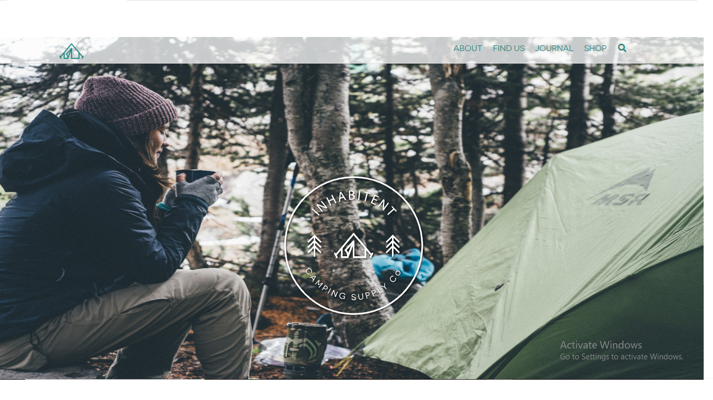

# Inhabitent

# About Inhabitent
      Inhabitent is a hipster "camping" website that offers camping related products and advice as well as blog arictles on the subject. it contain a page to display all the different products and blog posts as well as single pages with more detail on oth the blog entries and products, as well as a short aboutf or the site.

# How to run
      to run Inhabitent a server such as Wamp, Mamp or Xamp is needed to be running. gulp is not necessary to show the site but was used on production thru the code and turned on thru a command center to allow browsersync and keep the css auto updating. php and html were used for the main structure/skeleton of the site, javascript as well as css were also used in this project.

# Skills learnt from this project
      Inhabitent contained a fair bit of php so I learnt about the overall structure of php and how to call php functions that are written elsewhere in the wordpress code so now i feel much more comfortable working with a wordpress site, however there were still things I would preffer to hardcode instead of putting into the wordpress dashboard then writting the code to show it such as styling featured images like the hero banners. I found trying to manage php, scss, wordpress and gulp all together on the same site to be convoluted but by the end that stuff was more clear.

# Authors 
-Michael Dunk

# Boilerplate/template Authors/Acknowledgements
-Red Academy